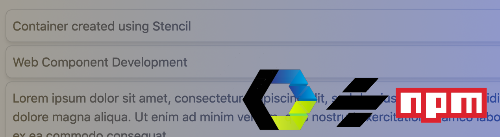
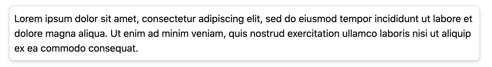
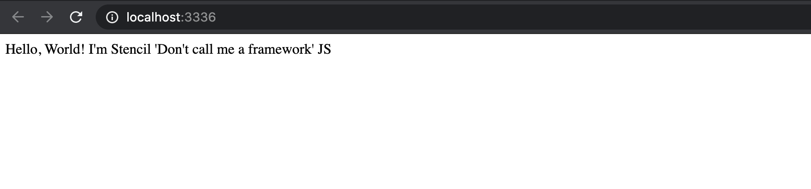
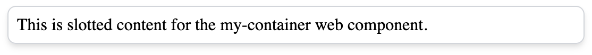
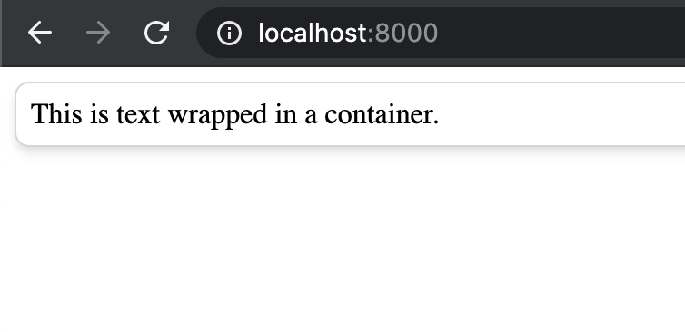

Not long ago, the concept of web components seemed to feel so far in the future. In 2021, more and more companies and design systems are starting to build web component solutions. 

In the first post of The Blinking Marquee, we’ll dive into the process of building and publishing a very simple web component to the public [NPM registry](https://www.npmjs.com/). This is the first post of hopefully many that will focus on concepts within front-end application development, an environment that is constantly evolving with new technology being introduced every single day.

Before we go too far...

## What is a Web Component?

Keeping things simple: it is technology that allows developers to build custom application elements using JavaScript APIs, an encapsulated DOM tree, and reusable templates. For all of the details, take a look at [webcomponents.org](https://www.webcomponents.org/introduction#what-are-web-components-).

## Why are Web Components Useful?

Regardless of the scope of work, computing technology has always set out to accomplish a core goal: abstract programming patterns so that those patterns can be reused, and make the life of a developer more efficient. Computing thrives on abstraction of code.

Web components are an abstraction for UI/UX development. They help design and development teams define a common, reusable user interface across an application, or even a suite of applications. And while it is possible to accomplish the implementation of this concept with amazing Javascript frameworks like React, Angular, and Vue, web components are technology-agnostic. You can develop the components once and use them with any Javascript technology, server-side technology, or just a plain old HTML file.

## How Can Web Components Be Created? 

Developers can use the web components API directly with vanilla Javascript. But again, abstractions exist to make our lives easier. [Many libraries and tools now exist](https://www.webcomponents.org/libraries) to help us more easily create web components, like [Polymer](https://www.polymer-project.org/), [LitElement](https://github.com/Polymer/lit-element), and [Stencil](https://stenciljs.com/). 

This tutorial will utilize Stencil. It's a build-time compiler that generates web components utililizing Typescripx and JSX, a similar concept familiar to React developers. 

> [Read more about Stencil](https://stenciljs.com/docs/introduction), its tooling, and its benefits.

## Let’s Get Started

### The Component

We'll build a very simple `container` component as an example.



This will be nothing more than a wrapper for content that applies basic style. It will be utilized as a building block for some other components on this blog. 

Later posts will deal with more detailed patterns, but the focus now is the basics. Setup, a basic build, and publishing. 

### Install Dependencies

#### Stencil

As explain in Stencil's [Getting Started documentation](https://stenciljs.com/docs/getting-started), as long as you have [Node.js](https://nodejs.org/en/) installed, all you need to do is run:

``` bash
$ npm init stencil
```

This command will walk you through the setup of a stencil project. You can set up an application, progressive web app, or a component. For this purpouse, we will be building a `component`. By choosing the `component` option, it will scaffold an environment where you can set up multiple components as a library.

You will be promoted to choose a project name, and that's it! `cd` into your project directory, run `npm install`, then `npm start`. A browser tab will launch a demo app running with a sample web component displayed.

#### Tailwind CSS

We are also going to be using [Tailwind CSS](https://tailwindcss.com/), a versatile CSS framework packed with utility classes. Try it out if you haven't already. It's a really interesting perspective on the CSS framework concept.

``` bash
$ npm install tailwindcss --save-dev
```

A few of Tailwind's peer dependencies will need to be installed:

``` bash
$ npm install postcss autoprefixer @stencil/postcss @types/autoprefixer --save-dev
```

Then create a `tailwind.config.js` file:

``` bash
npx tailwindcss init
```

Complete the tailwind setup by adding a few imports to the `stencil.config.ts` file:

``` ts
import { postcss } from '@stencil/postcss';
import autoprefixer from 'autoprefixer';
import tailwindcss from 'tailwindcss';
```

And then configure the `postcss` plugin configured with `autoprefixer` and `tailwindcss`:

``` ts
plugins: [
  postcss({
    plugins: [autoprefixer(), tailwindcss()]
  })
]
```

Your final `stencil.config.ts` will look like:

``` ts
import { Config } from '@stencil/core';
import { postcss } from '@stencil/postcss';
import autoprefixer from 'autoprefixer';
import tailwindcss from 'tailwindcss';

export const config: Config = {
  namespace: 'planit-components',
  outputTargets: [
    {
      type: 'dist',
      esmLoaderPath: '../loader',
    },
    {
      type: 'dist-custom-elements-bundle',
    },
    {
      type: 'docs-readme',
    },
    {
      type: 'www',
      serviceWorker: null, // disable service workers
    },
  ],
  plugins: [
    postcss({
      plugins: [autoprefixer(), tailwindcss()]
    })
  ]
};
```

Now test out your progress so far. Start the server:

``` bash
npm start
```

And you should see Stencil's default web component render in the browser:



### Development

Now its time to get to the actual development ...

Stencil makes things easy for us again. It comes with a command to scaffold a web component for you, so that you don't need to remember all of the details and make sure everything is manually set up just right. Just run:

``` bash
npm run generate my-container
```

... replacing the `my` with whatever you'd like as your prefix. It is a requirement for your component selector to have a prefix and contain a dash.

In your editor, you'll find your newly generated component under `src/components/my-container`. Witin the `my-container` directory, open `my-container.tsx` with your preferred editor. This is the main file we'll be editing to create the web component, and it will look something like this:

``` ts
import { Component, Host, h } from '@stencil/core';

@Component({
  tag: 'planit-container',
  styleUrl: 'planit-container.css',
  shadow: true,
})
export class PlanitContainer {

  render() {
    return (
      <Host>
        <slot></slot>
      </Host>
    );
  }

}
```

The first line of the component imports some core dependencies from the core Stencil package:

``` ts
import { Component, Host, h } from '@stencil/core';
```

Next is the component decorator that simply defines selector name (`tag`), the component's style sheet (`styleUrl`), and a `shadow` property that is set to `true`. This property specifies that the component will have its own encapsulated DOM that can't be affected by external style definitions. 

> [Read more about the Shadow DOM on webcomponents.org](https://www.webcomponents.org/community/articles/introduction-to-shadow-dom).

``` ts
@Component({
  tag: 'my-container',
  styleUrl: 'my-container.css',
  shadow: true,
})
```

Then comes the Typescript class:

``` ts
export class PlanitContainer {
  ...
}
```

And finally, the render() function:

``` ts
render() {
  return (
    <Host>
      <slot></slot>
    </Host>
  );
}
```

The render funcion contains the template for the web component. The container web component will be such a simple element that all of the work will be done within the template.

The `Host` element is the root-level wrapper in the web component's DOM tree. The `slot` element is where markup that lives outside of the web component, within the app, can be included in the web component's rendered markup. You are passing content to a slot in the web component.

Before we change the template, let's render an implementation of our new component within the `src/index.html` demo file. Just replace the default component that Stencil generated for us:

``` html
<!DOCTYPE html>
<html dir="ltr" lang="en">
  <head>
    <meta charset="utf-8" />
    <meta name="viewport" content="width=device-width, initial-scale=1.0, minimum-scale=1.0, maximum-scale=5.0" />
    <title>Stencil Component Starter</title>

    <script type="module" src="/build/my-components.esm.js"></script>
    <script nomodule src="/build/my-components.js"></script>
  </head>
  <body>
    <my-container>This is slotted content for the my-container web component.</my-container>
  </body>
</html>
```

Now when `npm start` is executed, the browser demo will show your new component with its slotted content.

The only thing left to do is style our container web component. Again, we will utilize Tailwind CSS to apply the visual look and feel for this example.

Open up `my-container.css` in your editor and add these three Tailwind imports to the top of the file:

``` css
@tailwind base;
@tailwind components;
@tailwind utilities;
```

These imports are necessary in order for the component to recognize Tailwind classes. Now add a div around the slot with the following Tailwind classes: `shadow-md border-gray-300 rounded-lg border p-2 mb-1`. 

``` ts
render() {
  return (
    <Host>
      <div class="shadow-md border-gray-300 rounded-lg border p-2 mb-1">
        <slot></slot>
      </div>
    </Host>
  );
}
```

- `shadow-md` applies a medium shadow to the container.
- `border-gray-300` applies a light grey border.
- `rounded-lg` rounds the borders of the container.
- `p-2` and `mb-1` define padding and margin.

Take a look at this [Tailwind Cheat Sheet](https://nerdcave.com/tailwind-cheat-sheet) for great documentation on the CSS tokens.

Now refresh the demo, and you'll see the style applied:



That's it! You have a basic container web component developed. It's time to publish the component to the public NPM registry.

### Publishing to NPM

It's pretty simple to publish a package to the [NPM registry](https://www.npmjs.com/):

1. Assuming you have already have [Node.js](https://nodejs.org/en/) installed on your machine, all you need to do is run `npm init`, and NPM will walk you through the process of setting up a `package.json` file. That said, Stencil already creates a `package.json` for you. It can be updated if you choose.

> There is also the option to [scope your NPM packages](https://docs.npmjs.com/creating-and-publishing-scoped-public-packages#creating-a-scoped-public-package).

2. You will need to regsiter with [npmjs.org](https://www.npmjs.com/signup), and after you have an account, login to the account locally in your terminal using the `npm adduser` command. This command will prompt you for your user name and password. After successfully logging in, you have access to publish!

3. Before you publish, the web component library needs to be compiled by running `npm run build`.

4. Bump the version of the package.json with `npm version <patch | minor | major>`. See [NPM Semantic Versioning documentation](https://docs.npmjs.com/about-semantic-versioning) for additional details.

5. Run `npm publish --access public` to publish the build package to the registry.

You can run steps #3 - #5 one-by-one, but its easier if you add an NPM script to your package.json that combines all of the commands into one.

``` json 
"release-package": "func() { npm run build && npm version \"$1\" && npm publish --access public; }; func"
```

Then simply run `npm run release-package patch` (or `minor`, or `major`) to build the library, bump the version, and publish the package.

> [Read more](https://stenciljs.com/docs/publishing) about publishing a Stencil library to NPM.
### Try Out Your Component

Now that your web component is published, you are ready to try it out by installing the NPM package into an application!

Just create a new directory somewhere on your machine:

``` bash
mkdir sample-app
```

Within the `sample-app` directory, add an `index.html` file:

``` html
<!doctype html>
<html lang="en">
<head>
  <meta charset="utf-8">
  <title>Sample App</title>
  <meta name="viewport" content="width=device-width, initial-scale=1">
  <link rel="icon" type="image/x-icon" href="favicon.ico">
</head>
<body>
  
</body>
</html>
```

Also within the `sample-app` directory, install the package that you published:

``` bash
npm install <your-npm-package>
```

We are just going to load the library locally from the `node_moudles` folder for the purpose of this tutorial. In reality, you would load the library by importing the web component into your JS framework code, or from a CDN.

> [Read the Stencil docs for distributing a component library](https://stenciljs.com/docs/distribution).

Update your `index.html` file to include a script referencing the web component library that was installed into `node_modules`, and then add the container web component in the body of the file:


``` html
<!doctype html>
<html lang="en">
<head>
  <meta charset="utf-8">
  <title>Sample App</title>
  <meta name="viewport" content="width=device-width, initial-scale=1">
  <link rel="icon" type="image/x-icon" href="favicon.ico">
  <script type="module" src="node_modules/<your-npm-package>/dist/<your-npm-package>/<your-npm-package>.esm.js"></script>
</head>
<body>
  <my-container>This is text wrapped in a container.</my-container>
</body>
</html>
```

Now run a web server from the `sample-app` directory. Any web server will do. If you are on a Mac, you can run:

``` bash
python -m SimpleHTTPServer 8000
```

Then go to `http://localhost:8000/` to view the sample usage of the web component you just created:



And that's it! You have created and published a Stencil web component. We'll dive deeper into a more complex web component that utilizes the container component in the next post. 

Thanks for reading and following along!

## Development Resources

### Tutorial Resources

- [PlanIt Repository](https://github.com/planavsky82/planit)
- [PlanIt Container Component](https://github.com/planavsky82/planit/tree/master/src/components/planit-container)

### Additional Resources

- [WebComponents.org](https://www.webcomponents.org/libraries)
- [Web Components Libraries](https://www.webcomponents.org/libraries)
- [Stencil](https://stenciljs.com/docs/introduction)
- [Node.js](https://nodejs.org/)
- [Node Package Manager](https://www.npmjs.com/)
- [Tailwind CSS](https://tailwindcss.com/)
- [Tailwind Cheat Sheet](https://nerdcave.com/tailwind-cheat-sheet)
- [NPM Semantic Versioning](https://docs.npmjs.com/about-semantic-versioning)
