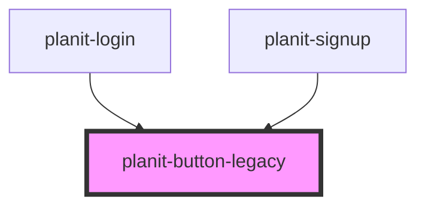

# planit-button

<!-- Auto Generated Below -->

## Properties

| Property | Attribute | Description | Type                              | Default    |
| -------- | --------- | ----------- | --------------------------------- | ---------- |
| `type`   | `type`    |             | `"button" \| "reset" \| "submit"` | `'button'` |

## Dependencies

### Used by

 - [planit-login](../planit-login)
 - [planit-signup](../planit-signup)

### Graph

----------------------------------------------

*Built with [StencilJS](https://stenciljs.com/)*
