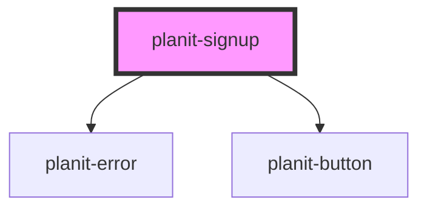

# planit-signup

<!-- Auto Generated Below -->

## Properties

| Property            | Attribute             | Description | Type     | Default               |
| ------------------- | --------------------- | ----------- | -------- | --------------------- |
| `labelEmailAddress` | `label-email-address` |             | `string` | `"Email Address"`     |
| `labelPassword1`    | `label-password-1`    |             | `string` | `"Password"`          |
| `labelPassword2`    | `label-password-2`    |             | `string` | `"Re-Enter Password"` |

## Events

| Event          | Description | Type                       |
| -------------- | ----------- | -------------------------- |
| `submitSignup` |             | `CustomEvent<SignUpEvent>` |

## Dependencies

### Depends on

- [planit-error](../planit-error)
- [planit-button](../planit-button)

### Graph

----------------------------------------------

*Built with [StencilJS](https://stenciljs.com/)*
